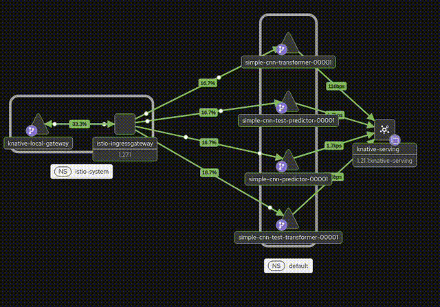

## EdgeNode

Edge Node is a Kubernetes-based AI inference platform designed to serve machine learning models into 5G k8s computing environments.

--------------------------------------------------------------------------

### Kiali high level view of the system result



-------------------------------------------------------------------------

I'm testing deployment on my PC with limited resources.

For this reason there are some mock elements:

- CNN models 
- pre-processing, i have to figure out the right way how to implement it
- there is not a load balancer for the istio gateway
- models weight are not loaded from a registry in cloud but are locally stored into PVs

Kserve allow to:
- scale in-out and to zero inference services
- deploy workload into gpu-cpu
- define priority for the runtime scheduler 
- traffic routing configuration by service mesh, managing rollbacks and version upgrades with various deployment strategies, including canary and blue-green releases
---

## Architecture
All the project has been executed on top of a Linux distriution as ubuntu 24.04.

EdgeNode has been developed on top of a Kubernetes stack:

- **KServe** → ML model serving and inference
- **Knative Serving** → autoscaling and serverless workloads
- **Istio** → service mesh for traffic management, security, and observability

---

## Prerequisites

Before getting started, make sure you have the following tools installed:

- [Docker](https://www.digitalocean.com/community/tutorials/how-to-install-and-use-docker-on-ubuntu-22-04) 
- [kubectl](https://kubernetes.io/docs/tasks/tools/) (by snap is good as well)
- [Helm](https://helm.sh/docs/intro/install/) (by snap is good as well)

---

## Supported Cluster Types

EdgeNode can run on different Kubernetes environments:

### Kind (recommended for local development)
A lightweight Kubernetes cluster running entirely inside Docker containers.
- [Kind](https://kind.sigs.k8s.io/docs/user/quick-start/#installation)
### K3s on VMs
A lightweight Kubernetes distribution running on virtual machines managed by a hypervisor as VirtualBox.
- [k3s](https://docs.k3s.io/quick-start)

--------------------------------------------------------------------------
## Quick Start

### Create a Kind cluster
The cluster will be created with:
- 1 control-plane node  
- 2 worker nodes
- 
```bash
kind create cluster --config kind-config.yaml
```

### Setup the Kserve cluster

The setup installs the following main components:
- Istio → service mesh for traffic management, security, and observability
- Knative → autoscaling and serverless workloads
- KServe → ML model serving and inference orchestration
- cert-manager → automatic TLS certificate management
- 
Clone the repo kserve:

```bash
git clone https://github.com/kserve/kserve
```

launch:

```bash
bash ./kserve/hack/kserve-install.sh 
```
Check system:
```bash
kubectl get pods -A
```

## Istio Ingress Gateway Tunneling

Kind does not provide a cloud-native LoadBalancer. To bypass the <pending> status of the Istio gataway SVC create a TCP tunnel. This maps port 8080 on the host machine to port 80 on the Ingress Gateway pod where it is listening.

 ```bash
kubectl port-forward --namespace istio-system svc/istio-ingressgateway 8080:80
```

--------------------------------------------------------------------------------
### Fast deploy

There is a fast deployment script for the inference cluster on kserve.
into cont.json there is the cluster configuration used by the deployment script. 

```bash
cd ./Deployment
python3 deploy-multi.py 

usage: deploy-multi.py [-h] [--deploy] [--delete] [--namespace NAMESPACE] [--config CONFIG]
Deployment and Cleanup Script for KServe.
options:
  -h, --help            show this help message and exit
  --deploy              Executes model deployment.
  --delete              Executes model deletion.
  --namespace NAMESPACE
                        Target namespace (default: 'default').
  --config CONFIG       Path to config file.
```
Execute the deploy:
```bash
python3 deploy-multi.py  --deploy
```
Check the cluster state:
```bash
kubectl get pods
NAME                                                            READY   STATUS    RESTARTS   AGE
simple-cnn-predictor-00001-deployment-556cb9c54f-dsfkm          2/2     Running   0          5m1s
simple-cnn-test-predictor-00001-deployment-6b74788d97-cbr6k     2/2     Running   0          4m56s
simple-cnn-test-transformer-00001-deployment-85c874dc69-nhgwx   2/2     Running   0          4m56s
simple-cnn-transformer-00001-deployment-6c7df5f947-cjjgx        2/2     Running   0          5m1s
```
Check the kserve knative inference services avalilability:
```bash
kubectl get ksvc
NAME                          URL                                                      LATESTCREATED                       LATESTREADY                         READY   REASON
simple-cnn-predictor          http://simple-cnn-predictor.default.example.com          simple-cnn-predictor-00001          simple-cnn-predictor-00001          True    
simple-cnn-test-predictor     http://simple-cnn-test-predictor.default.example.com     simple-cnn-test-predictor-00001     simple-cnn-test-predictor-00001     True    
simple-cnn-test-transformer   http://simple-cnn-test-transformer.default.example.com   simple-cnn-test-transformer-00001   simple-cnn-test-transformer-00001   True    
simple-cnn-transformer        http://simple-cnn-transformer.default.example.com        simple-cnn-transformer-00001        simple-cnn-transformer-00001        True    
```

## Inference Service Test

Use 'localhost:8080' because the tunnel bridges the local interface to  the cluster network beacuse the port-forwarding.
```bash
curl -X POST http://localhost:8080/v1/models/simple-cnn-test:predict \ 
     -H "Host: simple-cnn-test.default.example.com" \
     -H "Content-Type: application/json" \
     -d @image.json
{
"predicted_class":0,
"probabilities"[0.109329447,0.0996421501,...,0.0744211152],
"embedding":[0.0178625677,0.132521331,..,0.0090905251,0.184597969]
}
```
Test both the models
```bash
curl -X POST http://localhost:8080/v1/models/simple-cnn:predict \dict \
     -H "Host: simple-cnn.default.example.com" \
     -H "Content-Type: application/json" \
     -d @image.json
{
"predicted_class":0,
"probabilities":[0.109329447,0.0996421501..2,0.102014825,0.0744211152],
"embedding":[0.0178625677,..,0.184597969]
}
```
Delate the inference cluster:
```bash
python3 deploy-multi.py --delete
==> Starting cleanup in namespace: 'default'

--- Cleaning resources for: simple-cnn ---
  [DELETED] InferenceService
  [DELETED] PVC

--- Cleaning resources for: simple-cnn-test ---
  [DELETED] InferenceService
  [DELETED] PVC
```
## Workflow 

1. **Client** → POST to the istio gataway `http://localhost:8080/v1/models/<model>:predict`  
   Header `Host: <model>.<namespace>.example.com` allow Istio the detect the target
  > - `localhost:8080` → the Istio ingress gateway is exposed locally via `kubectl port-forward` for testing.  
  > - `/v1/models/<model>:predict` → the standard KServe prediction endpoint, where `<model>` is the name of the InferenceService.  
  > - The gateway internally routes the request to the correct transformer/predictor based on the `Host` header.

3. **Istio Ingress Gateway** routes request to the **Transformer**  
   `{model}-transformer.{namespace}.svc.cluster.local`

4. **Transformer** preprocesses:  
   decode base64 → grayscale → resize 28×28 → normalize

5. **Transformer** calls **Predictor** internally  
   `{model}-predictor.{namespace}.svc.cluster.local:8080`

6. **Predictor** runs inference → returns raw predictions

7. **Transformer** postprocesses: extracts `predicted_class`, `probabilities`, `embedding`

8. **Gateway** returns final JSON response to client

### Kiali 
execute the Observer:
```bash
cd Observation/
chmod +x install-monitoring.sh 
bash install-monitoring.sh 
kubectl port-forward svc/kiali -n istio-system 20001:20001
```
Kiali allows tracking service mesh traffic!

Traffic enters through the Istio gateway, while the Knative gateway maintains the service mesh traffic rules and redirects traffic to each service mesh entrypoints. The Knative Serving operator keeps track of the service proxy mesh traffic entrypoints.

