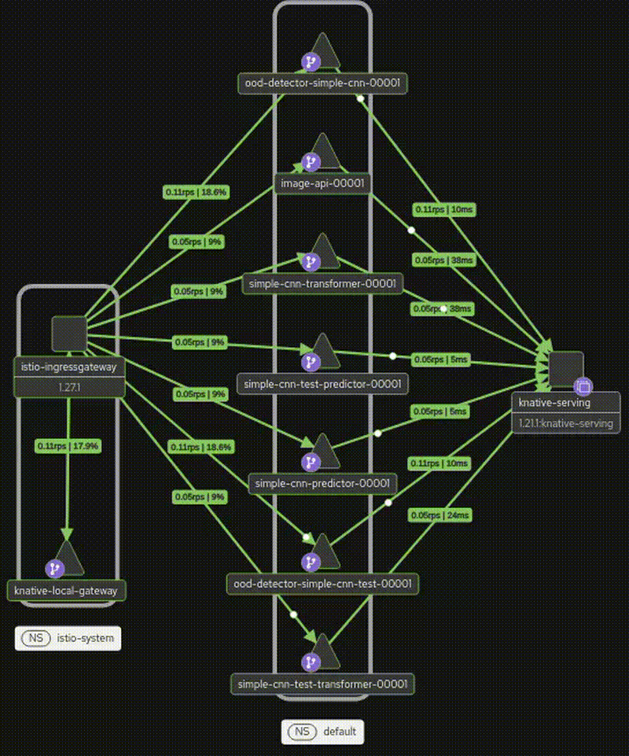

## EdgeNode

Edge Node is a Kubernetes-based AI inference platform designed to serve machine learning models into 5G k8s computing environments.
main files:
- [ RestAPI interface ](RestAPI/RestAPI.py)
- [ Inference entry point ](InferenceService/model/transformer_final.py)
- [ Strimzi Kafka cluster ](Knative_Eventing/Kafka/Kafka_cluster_multi_node.yaml)
- [ OOD detector ](Drift/driftv6.py)

--------------------------------------------------------------------------

### Kiali high level view of the system result



-------------------------------------------------------------------------

I'm testing deployment on my PC with limited resources.

For this reason there are some mock elements:

- CNN models 
- pre-processing, i have to figure out the right way how to implement it
- there is not a load balancer for the istio gateway
- models weight are not loaded from a registry in cloud but are locally stored into PVs

Kserve allow to:
- scale in-out and to zero inference services
- deploy workload into gpu-cpu
- define priority for the runtime scheduler 
- traffic routing configuration by service mesh, managing rollbacks and version upgrades with various deployment strategies, including canary and blue-green releases
---

## Architecture
All the project has been executed on top of a Linux distriution as ubuntu 24.04.

EdgeNode has been developed on top of a Kubernetes stack:

- **KServe** → ML model serving and inference
- **Knative Serving** → autoscaling and serverless workloads
- **Istio** → service mesh for traffic management, security, and observability

---

## Prerequisites

Before getting started, make sure you have the following tools installed:

- [Docker](https://www.digitalocean.com/community/tutorials/how-to-install-and-use-docker-on-ubuntu-22-04) 
- [kubectl](https://kubernetes.io/docs/tasks/tools/) (by snap is good as well)
- [Helm](https://helm.sh/docs/intro/install/) (by snap is good as well)

---

## Supported Cluster Types

EdgeNode can run on different Kubernetes environments:

### Kind (recommended for local development)
A lightweight Kubernetes cluster running entirely inside Docker containers.
- [Kind](https://kind.sigs.k8s.io/docs/user/quick-start/#installation)
### K3s on VMs
A lightweight Kubernetes distribution running on virtual machines managed by a hypervisor as VirtualBox.
- [k3s](https://docs.k3s.io/quick-start)

--------------------------------------------------------------------------
## Quick Start

### Create a Kind cluster
The cluster will be created with:
- 1 control-plane node  
- 2 worker nodes
- 
```bash
kind create cluster --config kind-config.yaml
```

### Setup the Kserve cluster

The setup installs the following main components:
- Istio → service mesh for traffic management, security, and observability
- Knative → autoscaling and serverless workloads
- KServe → ML model serving and inference orchestration
- cert-manager → automatic TLS certificate management
- 
Clone the repo kserve:

```bash
git clone https://github.com/kserve/kserve
```

launch:

```bash
bash ./kserve/hack/kserve-install.sh 
```
Check system:
```bash
kubectl get pods -A
```

## Istio Ingress Gateway Tunneling

Kind does not provide a cloud-native LoadBalancer. To bypass the <pending> status of the Istio gataway SVC create a TCP tunnel. This maps port 8080 on the host machine to port 80 on the Ingress Gateway pod where it is listening.

 ```bash
kubectl port-forward --namespace istio-system svc/istio-ingressgateway 8080:80
```
--------------------------------------------------------------------------------
### Knative Eventing with Kafka Deployment

The Knative configuration consists of a 3-node Strimzi Kafka cluster using the KRaft protocol. A Knative Broker configures the Kafka cluster as the primary event-driven message hub for Knative Eventing.

> Note: If the Kubernetes cluster is hosted remotely (i.e., not a local kind cluster), make sure the Kubernetes configuration file (kubeconfig) points to the correct cluster location.


```bash
cd Knative_Eventing

python3 deployv1.py

kubectl get pods -n kafka
NAME                                         READY   STATUS    RESTARTS   AGE
my-cluster-dual-role-0                       1/1     Running   0          4m54s
my-cluster-dual-role-1                       1/1     Running   0          4m54s
my-cluster-dual-role-2                       1/1     Running   0          4m54s
my-cluster-entity-operator-b55dd54f4-fs697   2/2     Running   0          3m59s
strimzi-cluster-operator-798fbc76f7-9qj69    1/1     Running   0          5m51s
```
--------------------------------------------------------------------------------
## REST API interface deployment
Deployment of the stateless rest api interface for edge node access
```bash
cd RestAPI

kubectl apply -f service.yaml 

kubectl get pods
NAME                                          READY   STATUS    RESTARTS   AGE
image-api-00001-deployment-74f4b4ff8b-ltrl9   2/2     Running   0          28s

kubectl get ksvc
NAME        URL                                    LATESTCREATED     LATESTREADY       READY   REASON
image-api   http://image-api.default.example.com   image-api-00001   image-api-00001   True
```
-----------------------------------------------------------------------------------------
### Inference fast deployment

A fast deployment script is available for setting up the inference cluster on KServe.
 The cluster configuration used by the deployment script can be found in cont.json.

The inference model weights are stored locally in a PV-PVC.
For production readiness, the inference service endpoint should be configured to point to the company's Kubeflow registry.

> Note: If the Kubernetes cluster is hosted remotely (i.e., not a local kind cluster), make sure the Kubernetes configuration file (kubeconfig) points to the correct cluster location.

```bash
cd ./Deployment
python3 deploy-multi.py 

usage: deploy-multi.py [-h] [--deploy] [--delete] [--namespace NAMESPACE] [--config CONFIG]
Deployment and Cleanup Script for KServe.
options:
  -h, --help            show this help message and exit
  --deploy              Executes model deployment.
  --delete              Executes model deletion.
  --namespace NAMESPACE
                        Target namespace (default: 'default').
  --config CONFIG       Path to config file.
```
Execute the deploy:
```bash
python3 deploy-multi.py  --deploy
```
Check the cluster state:
```bash
kubectl get pods
NAME                                                           READY   STATUS    RESTARTS   AGE
image-api-00001-deployment-74f4b4ff8b-ltrl9                    2/2     Running   0          5m58s
simple-cnn-predictor-00001-deployment-6b5b78dc4f-lgfnl         2/2     Running   0          84s
simple-cnn-test-predictor-00001-deployment-7c68b6d7d5-znmqt    2/2     Running   0          79s
simple-cnn-test-transformer-00001-deployment-57f67cd8d-52jll   2/2     Running   0          78s
simple-cnn-transformer-00001-deployment-84f75cdcdc-kwstb       2/2     Running   0 
```
Check the kserve knative inference services avalilability:
```bash
kubectl get ksvc
NAME                          URL                                                      LATESTCREATED                       LATESTREADY                         READY   REASON
image-api                     http://image-api.default.example.com                     image-api-00001                     image-api-00001                     True    
simple-cnn-predictor          http://simple-cnn-predictor.default.example.com          simple-cnn-predictor-00001          simple-cnn-predictor-00001          True    
simple-cnn-test-predictor     http://simple-cnn-test-predictor.default.example.com     simple-cnn-test-predictor-00001     simple-cnn-test-predictor-00001     True    
simple-cnn-test-transformer   http://simple-cnn-test-transformer.default.example.com   simple-cnn-test-transformer-00001   simple-cnn-test-transformer-00001   True    
simple-cnn-transformer        http://simple-cnn-transformer.default.example.com        simple-cnn-transformer-00001        simple-cnn-transformer-00001        True  
```
There are two container into each Pods beacuse one is the Service Mesh proxy sidecar.
-----------------------------------------------------------------------------------------
## OOD detector deployment
Deployment of a statefull ood microservice for each inference model
apply the knative local pod volume path:
```bash
kubectl patch configmap config-features \
  -n knative-serving \
  --type merge \
  -p '{
    "data": {
      "kubernetes.podspec-persistent-volume-claim": "enabled",
      "kubernetes.podspec-persistent-volume-write": "enabled",
      "kubernetes.podspec-fieldref": "enabled"
    }
  }'
```

start the deployment of each components

```bash
cd Drift
kubectl apply -f simple_model_OOD.yaml
kubectl apply -f simple_model_test_OOD.yaml

kubectl get pods
NAME                                                             READY   STATUS    RESTARTS   AGE
image-api-00001-deployment-74f4b4ff8b-ltrl9                      2/2     Running   0          11m
ood-detector-simple-cnn-00001-deployment-d4b854cb-trb4c          3/3     Running   0          77s
ood-detector-simple-cnn-test-00001-deployment-7bdd5c74f9-j7zd5   3/3     Running   0          10s
simple-cnn-predictor-00001-deployment-6b5b78dc4f-lgfnl           2/2     Running   0          7m5s
simple-cnn-test-predictor-00001-deployment-7c68b6d7d5-znmqt      2/2     Running   0          7m
simple-cnn-test-transformer-00001-deployment-57f67cd8d-52jll     2/2     Running   0          6m59s
simple-cnn-transformer-00001-deployment-84f75cdcdc-kwstb         2/2     Running   0          7m5s

kubectl get ksvc
NAME                           URL                                                       LATESTCREATED                        LATESTREADY                          READY   REASON
image-api                      http://image-api.default.example.com                      image-api-00001                      image-api-00001                      True    
ood-detector-simple-cnn        http://ood-detector-simple-cnn.default.example.com        ood-detector-simple-cnn-00001        ood-detector-simple-cnn-00001        True    
ood-detector-simple-cnn-test   http://ood-detector-simple-cnn-test.default.example.com   ood-detector-simple-cnn-test-00001   ood-detector-simple-cnn-test-00001   True    
simple-cnn-predictor           http://simple-cnn-predictor.default.example.com           simple-cnn-predictor-00001           simple-cnn-predictor-00001           True    
simple-cnn-test-predictor      http://simple-cnn-test-predictor.default.example.com      simple-cnn-test-predictor-00001      simple-cnn-test-predictor-00001      True    
simple-cnn-test-transformer    http://simple-cnn-test-transformer.default.example.com    simple-cnn-test-transformer-00001    simple-cnn-test-transformer-00001    True    
simple-cnn-transformer         http://simple-cnn-transformer.default.example.com         simple-cnn-transformer-00001         simple-cnn-transformer-00001         True    

```
Three container for the OOD detection Pods because has been added a Redis in memory store for blob images.
----------------------------------------------------------------------------------------
## PVC state
By default, kind uses the host's local storage via Rancher's Local Path Provisioner. Because this relies on local directories, it comes with limitations—such as a lack of cross-node volume replication, snapshots, or dynamic scaling.  To enable distributed block storage, enterprise features, and multi-node replication, an open-source storage provider like Longhorn can be deployed

```bash
kubectl get storageclass
NAME                 PROVISIONER             RECLAIMPOLICY   VOLUMEBINDINGMODE      ALLOWVOLUMEEXPANSION   AGE
standard (default)   rancher.io/local-path   Delete          WaitForFirstConsumer   false                  31m
```

```bash
kubectl get pvc
NAME                            STATUS   VOLUME                                     CAPACITY   ACCESS MODES   STORAGECLASS   VOLUMEATTRIBUTESCLASS   AGE
ood-queue-pvc-simple-cnn        Bound    pvc-527b491d-4b7b-43f5-a03b-9a0530398461   1Gi        RWO            standard       <unset>                 4m40s
ood-queue-pvc-simple-cnn-test   Bound    pvc-27da7c9e-d363-460d-9ae0-43d32df116eb   1Gi        RWO            standard       <unset>                 3m22s
redis-pvc-simple-cnn            Bound    pvc-556b62a2-2a90-46bc-82ca-cfa968f4e37a   1Gi        RWO            standard       <unset>                 4m40s
redis-pvc-simple-cnn-test       Bound    pvc-51104cd8-06d5-43bb-b773-83935eacab3c   1Gi        RWO            standard       <unset>                 3m22s
simple-cnn-pvc                  Bound    pvc-4d4dcab1-9659-42a0-b7b5-c9c602b4910e   100Mi      RWO            standard       <unset>                 10m
simple-cnn-test-pvc             Bound    pvc-7d7e920e-87d5-4d47-b0ad-e996dae7dd2f   200Mi      RWO            standard       <unset>                 10m
kubectl get pv
NAME                                       CAPACITY   ACCESS MODES   RECLAIM POLICY   STATUS   CLAIM                                   STORAGECLASS   VOLUMEATTRIBUTESCLASS   REASON   AGE
pvc-27da7c9e-d363-460d-9ae0-43d32df116eb   1Gi        RWO            Delete           Bound    default/ood-queue-pvc-simple-cnn-test   standard       <unset>                          7m35s
pvc-4c1cb9dc-ff54-4f0c-be92-159912c92ee9   10Gi       RWO            Delete           Bound    kafka/data-0-my-cluster-dual-role-0     standard       <unset>                          27m
pvc-4d4dcab1-9659-42a0-b7b5-c9c602b4910e   100Mi      RWO            Delete           Bound    default/simple-cnn-pvc                  standard       <unset>                          14m
pvc-51104cd8-06d5-43bb-b773-83935eacab3c   1Gi        RWO            Delete           Bound    default/redis-pvc-simple-cnn-test       standard       <unset>                          7m35s
pvc-527b491d-4b7b-43f5-a03b-9a0530398461   1Gi        RWO            Delete           Bound    default/ood-queue-pvc-simple-cnn        standard       <unset>                          8m41s
pvc-53e52fe0-9727-456c-acd7-cd52285fb748   10Gi       RWO            Delete           Bound    kafka/data-0-my-cluster-dual-role-1     standard       <unset>                          27m
pvc-556b62a2-2a90-46bc-82ca-cfa968f4e37a   1Gi        RWO            Delete           Bound    default/redis-pvc-simple-cnn            standard       <unset>                          8m41s
pvc-7d7e920e-87d5-4d47-b0ad-e996dae7dd2f   200Mi      RWO            Delete           Bound    default/simple-cnn-test-pvc             standard       <unset>                          14m
pvc-e2bf7e4c-fe3e-45a8-b596-ea59ceab3798   10Gi       RWO            Delete           Bound    kafka/data-0-my-cluster-dual-role-2     standard       <unset>                          27m
```

-----------------------------------------------------------------------------------------
## Inference Service Test
Because Kind do not have a load balancer I can access to cluster by the local host after a port forwarding through the istio gataway Pod.
The inference pass trough the RestAPI interface level 

```bash
cd /InferenceService/model_testing

curl -X POST \
"http://localhost:8080/predict_encoded?model=simple-cnn-test" \
-H "Host: image-api.default.example.com" \
-H "Content-Type: image/png" \
--data-binary @immagine.png

{"predicted_class":2}

curl -X POST "http://localhost:8080/predict_encoded?model=simple-cnn" \
-H "Host: image-api.default.example.com" \ 
-H "Content-Type: image/png" \
 --data-binary @immagine.png

{"predicted_class":2}
-------------------------------------------------------------------------------------------------
curl  -X POST \
"http://localhost:8080/predict_encoded_multipart" \
-H "Host: image-api.default.example.com" \
-F "image=@immagine.png" \
-F "model=simple-cnn"

{"predicted_class":2}

curl  -X POST "http://localhost:8080/predict_encoded_multipart" \
-H "Host: image-api.default.example.com" \
-F "image=@immagine.png" \
-F "model=simple-cnn-test"

{"predicted_class":2}
-------------------------------------------------------------------------------------------------
curl -X POST "http://localhost:8080/predict_batch_encoded_multipart" \
-H "Host: image-api.default.example.com" \
-F "files=@immagine.png" \
-F "files=@immagine.png" \
-F "models=simple-cnn,simple-cnn-test"-cnn,simple-cnn-test"

{"predictions":[{"model":"simple-cnn","predicted_class":2},{"model":"simple-cnn-test","predicted_class":2}]}
-------------------------------------------------------------------------------------------------
curl -X POST \
"http://localhost:8080/predict_batch_encoded?models=simple-cnn,simple-cnn-test" \
-H "Host: image-api.default.example.com" \
-H "Content-Type: application/octet-stream" \
-H "X-Image-Sizes: 674,674" \
--data-binary @batch.bin

{"predictions":[{"model":"simple-cnn","predicted_class":2},{"model":"simple-cnn-test","predicted_class":2}]}
-------------------------------------------------------------------------------------------------
curl -X POST \
"http://localhost:8080/predict?model=simple-cnn" \
-H "Host: image-api.default.example.com" \
-H "Content-Type: application/octet-stream" \
--data-binary @image.raw

{"predicted_class":0}

curl -X POST "http://localhost:8080/predict?model=simple-cnn-test" \
-H "Host: image-api.default.example.com" \
-H "Content-Type: application/octet-stream" \
--data-binary @image.raw

{"predicted_class":0}
-------------------------------------------------------------------------------------------------

curl -X POST \
"http://localhost:8080/predict_batch?models=simple-cnn,simple-cnn-test" \
-H "Host: image-api.default.example.com" \
-H "Content-Type: application/octet-stream" \
--data-binary @payload.bin

{"predictions":[{"model":"simple-cnn","predicted_class":0},{"model":"simple-cnn-test","predicted_class":0}]}

```

Check the system log to verify the operability:
```bash
kubectl logs <<<<<<<<<  image-api -pod name >>>>>>>>>>>>>

INFO:httpx:HTTP Request: POST http://istio-ingressgateway.istio-system.svc.cluster.local/v1/models/simple-cnn-test:predict "HTTP/1.1 200 OK"
INFO:RestAPI:simple-cnn-test -> 200 (Redis Key: b433a215-009e-4aee-b6b2-929e3c65b7e8)

INFO:httpx:HTTP Request: POST http://istio-ingressgateway.istio-system.svc.cluster.local/v1/models/simple-cnn:predict "HTTP/1.1 200 OK"
INFO:RestAPI:simple-cnn -> 200 (Redis Key: 96c53191-ad6d-42f1-9fe6-d6109728b684)

INFO:     10.244.1.7:0 - "POST /predict_batch_encoded?models=simple-cnn,simple-cnn-test HTTP/1.1" 200 OK

INFO:httpx:HTTP Request: POST http://istio-ingressgateway.istio-system.svc.cluster.local/store_image "HTTP/1.1 200 OK"
INFO:RestAPI:OK image has been saved with Redis key: b433a215-009e-4aee-b6b2-929e3c65b7e8

INFO:httpx:HTTP Request: POST http://istio-ingressgateway.istio-system.svc.cluster.local/store_image "HTTP/1.1 200 OK"
INFO:RestAPI:OK image has been saved with Redis key: 96c53191-ad6d-42f1-9fe6-d6109728b684


kubectl logs <<<<<<<<<<<< simple-cnn-transformer >>>>>>>>>>>>>>>

INFO:__main__:RAW IMAGE RECEIVED bytes=674
INFO:__main__:Preprocess received X-Image-Key: 96c53191-ad6d-42f1-9fe6-d6109728b684                     
INFO:__main__:Predictor output: {'predictions': [{'embedding': [0.00376976, .....
kub 0.103051201, 0.100030981, 0.0865775868]}]}
INFO:__main__:POST PROCESS 40 per Chiave: 96c53191-ad6d-42f1-9fe6-d6109728b684
2026-07-22 11:48:14.262 kserve.trace requestId: 6f962001-797a-45cb-9905-e948fd6df6dc, preprocess_ms: 8.805990219, explain_ms: 0, predict_ms: 43.231010437, postprocess_ms: 0.738620758
2026-07-22 11:48:14.263 uvicorn.access INFO:     10.244.1.7:0 1 - "POST /v1/models/simple-cnn%3Apredict HTTP/1.1" 200 OK
2026-07-22 11:48:14.264 kserve.trace kserve.io.kserve.protocol.rest.v1_endpoints.predict: 0.05603528022766113
2026-07-22 11:48:14.264 kserve.trace kserve.io.kserve.protocol.rest.v1_endpoints.predict: 0.022173999999999694
INFO:__main__:Kafka event sent for Key: 96c53191-ad6d-42f1-9fe6-d6109728b684 | batch=1


kubectl logs <<<<<< ood-detector-pod name >>>>>>

INFO:ood-detector:Image saved in redis with key value: image:96c53191-ad6d-42f1-9fe6-d6109728b684
INFO:     10.244.1.7:0 - "POST /store_image HTTP/1.1" 200 OK

INFO:ood-detector:Enqueued ef6a6241-ce29-430b-91a6-ba9562cd7603 | Key: 96c53191-ad6d-42f1-9fe6-d6109728b684 (1) queue=1
INFO:     10.244.1.7:0 - "POST / HTTP/1.1" 204 No Content

INFO:ood-detector:Processing 1 elements from event ef6a6241-ce29-430b-91a6-ba9562cd7603 (Image Key: 96c53191-ad6d-42f1-9fe6-d6109728b684)
WARNING:ood-detector:OOD detected with redis key -> 96c53191-ad6d-42f1-9fe6-d6109728b684
INFO:ood-detector:Retrieved OOD image blob (674 bytes) for key image:96c53191-ad6d-42f1-9fe6-d6109728b684
INFO:ood-detector:Retrieved OOD metadata: {b'filename': b'image.png', b'content_type': b'image/png', b'timestamp': b'2026-07-22T11:48:14.290906+00:00', b'ttl': b'600', b'metadata': b'simple-cnn', b'resolved_key': b'image:96c53191-ad6d-42f1-9fe6-d6109728b684'}
INFO:ood-detector:TTL extended to 86400s for key: image:96c53191-ad6d-42f1-9fe6-d6109728b684
INFO:ood-detector:Finished processing event ef6a6241-ce29-430b-91a6-ba9562cd7603
```
test the helth check end point:
```bash
curl -H "Host: ood-detector-simple-cnn-test.default.example.com" http://localhost:8080/health

{"status":"ok","queue_size":0,"threshold":0.2,"processed_counter":1,"ood_buffer_size":0,"redis_success_ops":1,"redis_errors":0,"redis_ttl_update":1}(env)

curl -H "Host: ood-detector-simple-cnn.default.example.com" http://localhost:8080/health

{"status":"ok","queue_size":0,"threshold":0.2,"processed_counter":1,"ood_buffer_size":0,"redis_success_ops":1,"redis_errors":0,"redis_ttl_update":1}(env)
```
-------------------------------------------------------
### Kiali 
execute the Observer:
```bash
cd Observation/
chmod +x install-monitoring.sh 
bash install-monitoring.sh 
kubectl port-forward svc/kiali -n istio-system 20001:20001
```
Kiali allows tracking service mesh traffic!

Traffic enters through the Istio gateway, while the Knative gateway maintains the service mesh traffic rules and redirects traffic to each service mesh entrypoints. The Knative Serving operator keeps track of the service proxy mesh traffic entrypoints.

